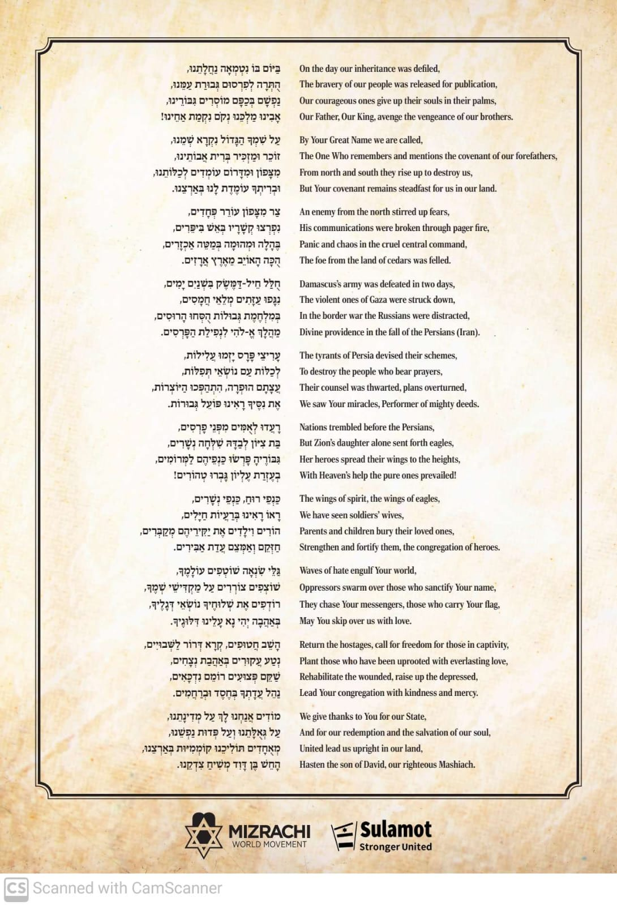

# Tisha B'Av Media Collection

  

>A curated list of resources, videos, and images for Tisha B'Av.

  

---

  

## 📺 Videos

  

- <a href="https://youtu.be/SCcVZb_jVZU?si=clQMk-y6zZosx2QC" target="_blank" rel="noreferrer">Finding Mashiach - Berel Solomon</a> The meaning of Tisha B'Av, and common questions 🆓

    

        
<a href="https://hashkifa.com/checkout?vid=801&purchase_enable=true" target="_blank" rel="noreferrer">Hidden Light - Rabbi Yoel Gold</a> — UNCOVERING ROME'S MOST GUARDED SECRET 💲

        
    

- <a href="https://www.youtube.com/watch?v=mtGUyFcqFhE&t=1350s" target="_blank" rel="noreferrer">The Mourning After - Feat. Shai Graucher</a> — Stories from October 7th 

---

## 🎧 Podcasts

    <a href="https://www.jle.org.uk/pages/podcast" target="_blank" rel="noreferrer">
        HISTORY FOR THE CURIOUS </a> - RABBI AUBREY HERSH
    

  

## 📃 Other Resources

Kinah for the Events of "Swords of Iron"

## 😂 Memes

